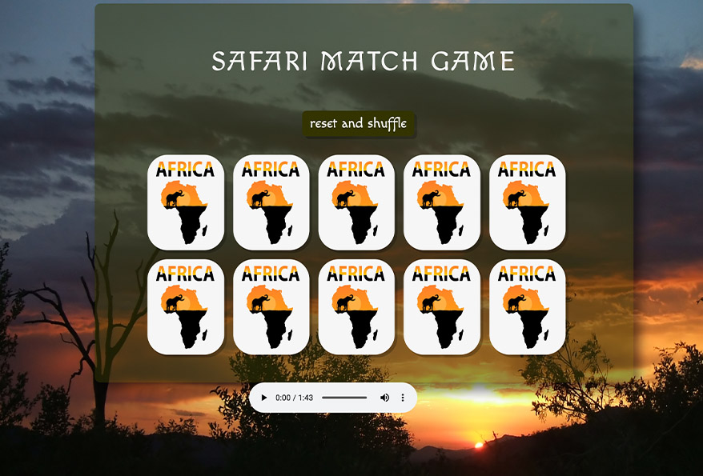

# Wu-Tang Name Generator

### Goal: Create a Wu-Tang Clan name generator. Present the user with 5 survey questions and based on those answers randomly generate their name. The name doesn't have to be exact names, but Wu-Tang sounding-ish names. Ex: Childish Gambino (who actually got his name from a Wu-Tang name generator).

- Code on Anwser branch

**Link To Project:** https://wutanggenerator.netlify.app/

### How this project was created:
HTML, Javascript, Node.js, and CSS
